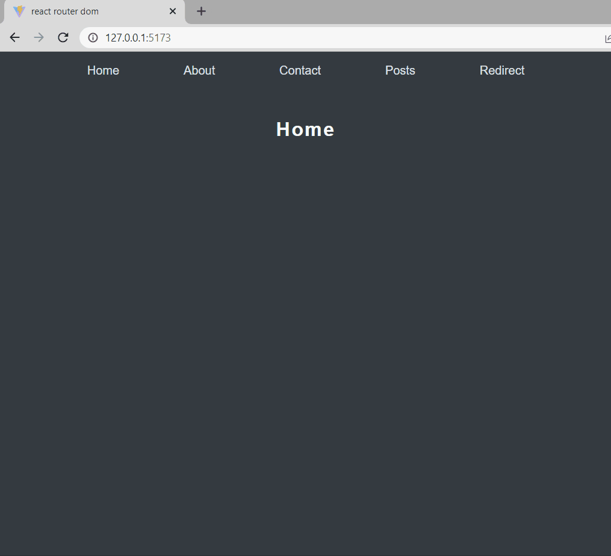

<h1 align="center">React-router-dom</h1>
<h4 align="center">Aplicação web com sistema SPA</h4>
<h4 align="center">Feito com React.js e a biblioteca react-router-dom</h4>

 &#xa0;

**
Sumário
**

<a href="#dart-sobre">Sobre</a> &#xa0; | &#xa0;
<a href="#books-O-que-eu-aprendi">O que aprendi</a> &#xa0; | &#xa0;
<a href="#white_check_mark-funcionalidades">Funcionalidades</a> &#xa0; | &#xa0;
<a href="#computer-tecnologias">Tecnologias</a> &#xa0; | &#xa0;
<a href="#hammer_and_wrench-serviços">Serviços</a>

<a href="#camera-imagens">Imagens</a> &#xa0; | &#xa0;
<a href="#orange_book-como-usar">Como usar</a> &#xa0; | &#xa0;
<a href="#scroll-pré-requisitos">Pré-requisitos</a> &#xa0; | &#xa0;
<a href="#link-links">Links</a> &#xa0; | &#xa0;
<a href="#sparkles-autor">Autor</a>

 &#xa0;
 
## :dart: Sobre

O principal objetivo do projeto foi aprender a utilizar a biblioteca react-router-dom para criar uma aplicação SPA.

SPA vem de Single Page Applications (Aplicações de Página Única), são aplicações cuja funcionalidade está concentrada em uma única página. Ao invés de recarregar toda a página ou redirecionar o usuário para uma página nova, apenas o conteúdo principal é atualizado de forma assíncrona, mantendo toda a estrutura da página estática.

&#xa0;

## :books: O que eu aprendi?

📌 O que é um sistema SPA;

📌 Vantagens de utilizar SPA;

📌 Criar rotas com a biblioteca react-router-dom;

📌 Navegar entre as rotas;

📌 Utilizar parâmetros nas rotas;

📌 Criar rota em caso de erro 404;

📌 Enviar e receber estados entre as rotas.

&#xa0;

## :white_check_mark: Funcionalidades
A principal funcionalidade do projeto é:

✔️ Permitir o usuário atualizar o conteúdo sem a necessidade da página ser recarregada.

&#xa0;

## :computer: Tecnologias
* [HTML](https://developer.mozilla.org/pt-BR/docs/Web/HTML)

* [TypeScript](https://www.typescriptlang.org/)

* [React.js](https://pt-br.reactjs.org/)

* [React Router Dom](https://reactrouter.com/en/main)

* [Styled Components](https://styled-components.com/)

&#xa0;

## :hammer_and_wrench: Serviços
* <a href="https://github.com/">GitHub</a>

* <a href="https://www.netlify.com/">Netlify </a>- hospedagem

&#xa0;

## :camera: Imagens
**
Exemplo de funcionamento:
**

  

&#xa0;

## :orange_book: Como usar

Acesse a aplicação pelo link.

No cabeçalho, terá um menu com os conteúdos que você pode selecionar para atualizar na página.

&#xa0;

## :scroll: Pré requisitos
Para utilizar o sistema, basta um navegador de sua preferência e conexão com internet.

&#xa0;

## :link: Links
* Repositório: https://github.com/CaioAugustoHD/react-router-dom
* Deploy: https://test-reactrouterdom.netlify.app/

&#xa0;

## :sparkles: Autor

<h4>Feito por Caio Augusto Pereira</h4>

&#xa0;

 

